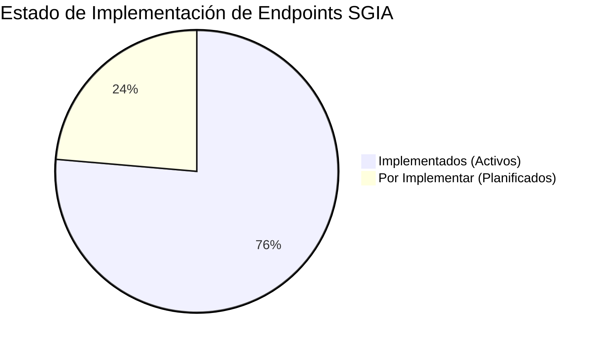

# Catálogo de Endpoints — SGIA Backend API

> Sistema de Gestión de Inventario y Almacenamiento (INACAP Sede Temuco)  
> Base URL local: `http://localhost:8000/api`  
> Formato de datos: `application/json`  
> Mecanismo de autenticación: `Bearer Token` vía Laravel Sanctum en cabecera `Authorization: Bearer <token>`.

---

## Convenciones y Roles de Usuario

| Código | Rol | Descripción |
|---|---|---|
| **AD-01** | Administrador | Acceso total al sistema, gestión de usuarios, auditoría y catálogos. |
| **DIR-01** | Director de Carrera / Asesor | Subida de facturas, cotizaciones, órdenes de compra, reportes y dashboards. |
| **PAN-01** | Pañolero / Encargado | Altas de productos, códigos de barra, préstamos presenciales/remotos y devoluciones. |
| **PRO-01** | Docente / Profesor | Solicitud remota de préstamos de pañol, catálogo y reporte de novedades. |

---

## 🟢 Endpoints Implementados (Listos para Uso)

### 1. Autenticación y Sesiones (`FU-01` / `REQ-01`)

| Método | Endpoint | Roles Permitidos | Descripción / Parámetros | Estado |
|---|---|---|---|:---:|
| `POST` | `/api/login` | Público | Autenticación con email y password. Rate limit: 5 intentos/min. Retorna Bearer token, expiración según dispositivo (`web` 8h, `mobile` 60d) y datos de usuario.  **Body:** `email`, `password`, `device_name` (`web` \| `mobile`). | ✅ Implementado |
| `GET` | `/api/me` | Todos (`auth`) | Retorna el recurso del usuario autenticado (`UserResource`) con rol, área, estado y último login. | ✅ Implementado |
| `GET` | `/api/user` | Todos (`auth`) | Alias idéntico de `GET /api/me`. | ✅ Implementado |
| `PUT` | `/api/password` | Todos (`auth`) | Cambio de contraseña del usuario autenticado. Valida contraseña actual, complejidad mínima (8 caracteres, letras y números) y revoca automáticamente las demás sesiones remotas. **Body:** `current_password`, `password`, `password_confirmation`. | ✅ Implementado |
| `POST` | `/api/change-password` | Todos (`auth`) | Alias idéntico de `PUT /api/password`. | ✅ Implementado |
| `POST` | `/api/logout` | Todos (`auth`) | Cierra la sesión activa revocando el Bearer token actual. | ✅ Implementado |
| `POST` | `/api/logout-all` | Todos (`auth`) | Revoca todos los tokens activos del usuario autenticado. | ✅ Implementado |
| `GET` | `/api/tokens` | Todos (`auth`) | Lista todos los tokens y dispositivos activos del usuario autenticado con fecha de creación y expiración. | ✅ Implementado |
| `DELETE` | `/api/tokens/{tokenId}` | Todos (`auth`) | Revoca un token o dispositivo específico por ID. | ✅ Implementado |
| `POST` | `/api/tokens/revoke-others` | Todos (`auth`) | Revoca todas las sesiones excepto la que realiza la petición. | ✅ Implementado |
| `POST` | `/api/tokens/revoke-all` | Todos (`auth`) | Alias de logout global para revocar todas las sesiones. | ✅ Implementado |

---

### 2. Administración de Usuarios (`FU-01` / `REQ-02`)

> Todos los endpoints de este módulo están restringidos estrictamente al rol **AD-01** (Administrador) y protegidos contra auto-eliminación o auto-desactivación del propio administrador.

| Método | Endpoint | Roles Permitidos | Descripción / Parámetros | Estado |
|---|---|---|---|:---:|
| `GET` | `/api/users` | `AD-01` | Listado paginado de usuarios con soporte de búsqueda y filtros. **Query Params:** `role`, `area`, `is_active`, `search` (nombre/email), `per_page` (1-100). | ✅ Implementado |
| `POST` | `/api/users` | `AD-01` | Crea un nuevo usuario en el sistema. **Body:** `name`, `email` (único), `role` (`AD-01`, `DIR-01`, `PAN-01`, `PRO-01`), `area` (opcional), `password`, `password_confirmation`, `is_active` (opcional). | ✅ Implementado |
| `GET` | `/api/users/{id}` | `AD-01` | Obtiene el detalle de un usuario específico. | ✅ Implementado |
| `PUT / PATCH` | `/api/users/{id}` | `AD-01` | Actualiza los datos de un usuario (nombre, rol, área, email con validación de unicidad ignorando propio ID, contraseña opcional). | ✅ Implementado |
| `DELETE` | `/api/users/{id}` | `AD-01` | Elimina un usuario y borra en cascada sus tokens y registros de sesión. | ✅ Implementado |
| `PATCH` | `/api/users/{id}/status` | `AD-01` | Activa o desactiva la cuenta sin borrarla. Si se desactiva (`is_active = false`), se revocan de inmediato todas sus sesiones activas. **Body:** `is_active` (`true` \| `false`). | ✅ Implementado |

---

### 3. Inventario y Productos (`FU-02` / `REQ-03`, `REQ-04`, `REQ-05`)

| Método | Endpoint | Roles Permitidos | Descripción / Parámetros | Estado |
|---|---|---|---|:---:|
| `GET` | `/api/products` | Todos (`auth`) | Listado paginado de productos con relaciones eager loaded (`supplier`, `location`). **Query Params:** `search` (nombre, código de barras o descripción), `area`, `is_active`, `supplier_id`, `location_id`, `sala`, `cajon`, `critical_only`, `per_page`. | ✅ Implementado |
| `POST` | `/api/products` | `AD-01`, `DIR-01`, `PAN-01` | Alta de producto. Si no se envía código de barras, genera automáticamente uno único tipo Code128 (`SGIA-XXXXXXXX`). Si se envían `sala` y `cajon`, crea/asocia la ubicación física automáticamente. **Body:** `name`, `description`, `barcode` (opcional), `quantity`, `stock_minimo`, `supplier_id`, `sala`, `cajon`, `area`, `photo_url`, `is_active`. | ✅ Implementado |
| `GET` | `/api/products/{id}` | Todos (`auth`) | Detalle de un producto con sus relaciones. | ✅ Implementado |
| `PUT / PATCH` | `/api/products/{id}` | `AD-01`, `DIR-01`, `PAN-01` | Edición de producto. Al modificar stock o stock mínimo, evalúa y dispara alertas de stock automáticamente. | ✅ Implementado |
| `DELETE` | `/api/products/{id}` | `AD-01`, `DIR-01` | Eliminación de producto de inventario. | ✅ Implementado |
| `PATCH` | `/api/products/{id}/status` | `AD-01`, `DIR-01`, `PAN-01` | Activa o desactiva un producto del inventario. **Body:** `is_active` (`true` \| `false`). | ✅ Implementado |
| `GET` | `/api/products/{id}/location` | Todos (`auth`) | Obtiene la sala, cajón y descripción de ubicación física de un producto. | ✅ Implementado |
| `PATCH` | `/api/products/{id}/location` | `AD-01`, `DIR-01`, `PAN-01` | Asigna o actualiza la ubicación física. **Body:** `location_id` o combinación de `sala` y `cajon` con `descripcion` opcional. | ✅ Implementado |
| `GET` | `/api/products/{id}/barcode` | Todos (`auth`) | Retorna el código de barras del producto, su representación vectorial en SVG y su formato Data URI / HTML. | ✅ Implementado |

---

### 4. Escaneo de Facturas vía OCR (`FU-02` / `REQ-03`)

| Método | Endpoint | Roles Permitidos | Descripción / Parámetros | Estado |
|---|---|---|---|:---:|
| `POST` | `/api/invoices/scan` | `AD-01`, `DIR-01` | Procesa documento o imagen de factura (PDF, PNG, JPG, JSON de hasta 10MB) y extrae número de factura, proveedor sugerido y lista de borradores de productos con cantidades y precios para su posterior confirmación. | ✅ Implementado |
| `POST` | `/api/products/scan-invoice` | `AD-01`, `DIR-01` | Alias idéntico de `POST /api/invoices/scan`. | ✅ Implementado |

---

### 5. Alertas de Stock Crítico (`FU-02` / `REQ-06`)

| Método | Endpoint | Roles Permitidos | Descripción / Parámetros | Estado |
|---|---|---|---|:---:|
| `GET` | `/api/alerts/critical-stock` | Todos (`auth`) | Listado paginado de alertas activas generadas automáticamente cuando un producto llega a `stock_minimo + 5` (warning) o a `<= stock_minimo` (critical). **Query Params:** `alert_type` (`warning` \| `critical`), `is_resolved` (`false` por defecto), `per_page`. | ✅ Implementado |
| `PATCH` | `/api/alerts/{id}/resolve` | `AD-01`, `PAN-01` | Marca manualmente una alerta de stock como resuelta. | ✅ Implementado |

---

### 6. Compras y Adquisiciones (`FU-03` / `REQ-08`)

> Máquina de estados de las órdenes (`App\Services\PurchaseStateMachine`): **`pendiente` → `en_camino` → `completa`**. Las órdenes pueden generarse a partir de una cotización aceptada de REQ-07 (ver sección 8), en cuyo caso la cotización queda `convertida`.

| Método | Endpoint | Roles Permitidos | Descripción / Parámetros | Estado |
|---|---|---|---|:---:|
| `GET` | `/api/purchases` | `AD-01`, `DIR-01`, `PAN-01` | Listado paginado de órdenes de compra con proveedor e ítems. **Query Params:** `status` (alias `estado`: `pendiente`, `en_camino`, `completa`), `supplier_id`, `quotation_id`, `search` (código, guía o factura), `per_page` (1-100). | ✅ Implementado |
| `POST` | `/api/purchases` | `AD-01`, `DIR-01` | Registra una nueva orden de compra en estado `pendiente`. Genera código único (`OC-<año>-XXXXXX`), persiste los ítems y calcula el total. Si se envía `quotation_id` de una cotización **aceptada**, copia proveedor e ítems de la cotización (a menos que se envíen explícitamente) y la marca como `convertida`. **Body:** `quotation_id` **o** `supplier_id` + `items` (array con `name`, `quantity`, `unit_price` opcional, `product_id` opcional; mínimo 1), `quotation_reference`, `expected_at`, `notes`. | ✅ Implementado |
| `GET` | `/api/purchases/{id}` | `AD-01`, `DIR-01`, `PAN-01` | Detalle de la orden de compra, sus ítems adquiridos, la cotización de origen y las transiciones permitidas (`allowed_transitions`). | ✅ Implementado |
| `PATCH` | `/api/purchases/{id}/status` | `AD-01`, `DIR-01`, `PAN-01` | Transición de estados según la máquina (`pendiente` → `en_camino` → `completa`); una transición inválida responde `422` con los estados permitidos. Al pasar a `completa` registra `received_at` y notifica al pañolero para el ingreso físico a stock. **Body:** `status` (alias `estado`). | ✅ Implementado |
| `POST` | `/api/purchases/{id}/arrival-scan` | `AD-01`, `DIR-01`, `PAN-01` | Marca la orden como `completa` al escanear la guía de despacho / factura de llegada: extrae el número de factura vía OCR, guarda el documento escaneado y notifica al pañolero (PAN-01). **Body (multipart o JSON):** `document` (PDF, PNG, JPG, WEBP o JSON hasta 10MB), `guide_number`, `invoice_number` (al menos uno de los tres). | ✅ Implementado |

---

### 7. Proveedores (`FU-03` / `REQ-07`)

| Método | Endpoint | Roles Permitidos | Descripción / Parámetros | Estado |
|---|---|---|---|:---:|
| `GET` | `/api/suppliers` | `AD-01`, `DIR-01`, `PAN-01` | Listado paginado de empresas proveedoras. **Query Params:** `category`, `is_active`, `search` (nombre, contacto o correo), `per_page` (1-100). Incluye `products_count`. | ✅ Implementado |
| `POST` | `/api/suppliers` | `AD-01`, `DIR-01` | Crear proveedor. **Body:** `name`, `contact_name`, `email`, `phone`, `category`, `is_active`. | ✅ Implementado |
| `GET` | `/api/suppliers/{id}` | `AD-01`, `DIR-01`, `PAN-01` | Detalle del proveedor y su historial de productos suministrados. | ✅ Implementado |
| `PUT / PATCH` | `/api/suppliers/{id}` | `AD-01`, `DIR-01` | Actualizar información del proveedor. | ✅ Implementado |
| `DELETE` | `/api/suppliers/{id}` | `AD-01` | Eliminar proveedor; si tiene productos asociados solo se desactiva, preservando el historial de inventario. | ✅ Implementado |
| `PATCH` | `/api/suppliers/{id}/status` | `AD-01`, `DIR-01` | Activar o suspender proveedor. **Body:** `is_active` (`true` \| `false`). | ✅ Implementado |

---

### 8. Cotizaciones Automáticas (`FU-03` / `REQ-07`)

> Máquina de estados de las cotizaciones (`App\Services\QuotationStateMachine`): **`pendiente` → `aceptada` / `rechazada` → `convertida`** (al generarse la orden de compra, ver sección 6). Además, cada proveedor contactado registra su propia respuesta (`pendiente`, `aceptada`, `rechazada`).

| Método | Endpoint | Roles Permitidos | Descripción / Parámetros | Estado |
|---|---|---|---|:---:|
| `POST` | `/api/quotations` | `AD-01`, `DIR-01` | Crea la cotización, persiste ítems y proveedores contactados y **envía por correo la solicitud a los 3+ proveedores seleccionados** (`App\Services\QuotationEmailService` + `QuotationRequestMail`). Devuelve `emails_sent`. **Body:** `products` (array con `id` y `quantity`, mínimo 1), `supplier_ids` (mínimo 3 proveedores distintos), `notes`, `expires_at`. | ✅ Implementado |
| `GET` | `/api/quotations` | `AD-01`, `DIR-01` | Historial de cotizaciones emitidas con ítems y proveedores contactados. **Query Params:** `status` (alias `estado`: `pendiente`, `aceptada`, `rechazada`, `convertida`), `search` (código), `per_page`. | ✅ Implementado |
| `GET` | `/api/quotations/{id}` | `AD-01`, `DIR-01` | Detalle de la cotización: ítems, proveedores contactados con su respuesta (`status`, `offer_total`, `responded_at`), orden de compra generada y transiciones permitidas. | ✅ Implementado |
| `PATCH` | `/api/quotations/{id}/status` | `AD-01`, `DIR-01` | Transición según la máquina de estados; `422` con los estados permitidos si es inválida. **Body:** `status` (alias `estado`). | ✅ Implementado |
| `PATCH` | `/api/quotations/{id}/responses` | `AD-01`, `DIR-01` | Registra la respuesta de un proveedor contactado. Al registrar una aceptación la cotización pasa a `aceptada`; si todos rechazan, a `rechazada`. **Body:** `supplier_id`, `status` (`aceptada` \| `rechazada`), `offer_total`, `notes`. | ✅ Implementado |

---

### 9. Préstamos Remotos (Pre-reservas Docente) (`FU-04` / `REQ-09`)

> Máquina de estados de los préstamos (`App\Services\LoanStateMachine`): **`pendiente` → `en_proceso` → `procesado`**, con salida a `rechazado` (operaciones del pañol en la sección 10). El docente solo crea y consulta sus propias solicitudes.

| Método | Endpoint | Roles Permitidos | Descripción / Parámetros | Estado |
|---|---|---|---|:---:|
| `POST` | `/api/loans/requests` | `PRO-01` | Solicita préstamo remoto de insumos/equipos para clases. Genera código único (`REM-<año>-XXXXXX`) y responde **"Solicitud enviada correctamente."** junto al registro creado (claves `data` y `loan`) en estado `pendiente`. Valida que cada producto exista, esté activo y tenga stock suficiente. **Body:** `items` (array con `product_id` y `quantity`, mínimo 1), `subject` (alias `asignatura`), `room` (alias `sala`), `loan_date` (alias `fecha`), `time_block` (opcional), `notes` (opcional). | ✅ Implementado |
| `GET` | `/api/loans/requests` | `PRO-01` | Listado paginado de las solicitudes **propias** del docente autenticado. **Query Params:** `estado` (alias `status`: `pendiente`, `en_proceso`, `procesado`, `rechazado`), `per_page` (1-100). | ✅ Implementado |
| `GET` | `/api/loans/my-requests` | `PRO-01` | Alias idéntico de `GET /api/loans/requests` (referencia del catálogo original). | ✅ Implementado |
| `DELETE` | `/api/loans/requests/{id}` | `PRO-01` | Cancelación de solicitud mientras permanezca en estado `pendiente`. | ⏳ Pendiente |

---

## 🟡 Endpoints Pendientes (Por Implementar)

### 10. Operación de Préstamos en Pañol (`FU-04` / `REQ-10`)

| Método | Endpoint Planificado | Roles Previstos | Descripción / Parámetros esperados |
|---|---|---|---|
| `GET` | `/api/loans/pending` | `PAN-01`, `AD-01` | Listado de solicitudes remotas pendientes por despachar con stock disponible y ubicación física de los ítems. |
| `POST` | `/api/loans/{id}/approve` | `PAN-01` | Aprueba solicitud remota, aparta el stock y notifica al docente. |
| `POST` | `/api/loans/{id}/reject` | `PAN-01` | Rechaza solicitud indicando motivo obligatorio (`rejection_reason`) y notifica al docente. |
| `POST` | `/api/loans/checkout` | `PAN-01` | Préstamo presencial directo mediante escaneo de credencial del docente + escaneo de código de barras de cada ítem entregado. Descuenta stock atómicamente. |
| `POST` | `/api/loans/checkin` | `PAN-01` | Devolución de préstamo mediante escaneo de ítems. Reintegra stock o marca ítem en reparación si se reporta daño. |

---

### 11. Historial y Auditoría de Préstamos (`FU-04` / `REQ-11`)

| Método | Endpoint Planificado | Roles Previstos | Descripción / Parámetros esperados |
|---|---|---|---|
| `GET` | `/api/loans` | `PAN-01`, `DIR-01`, `AD-01` | Listado general de préstamos con filtros por docente, asignatura, sala, estado (`activo`, `devuelto`, `atrasado`, `en_proceso`, `procesado`). |
| `GET` | `/api/loans/{id}` | `PAN-01`, `DIR-01`, `AD-01` | Detalle completo de un préstamo, historial de eventos y observaciones de devolución. |
| `GET` | `/api/loans/export` | `DIR-01`, `PAN-01`, `AD-01` | Exportación de préstamos en formato PDF o Excel por rango de fechas. |

---

### 12. Fichas Técnicas de Equipos (`FU-05` / `REQ-12`)

| Método | Endpoint Planificado | Roles Previstos | Descripción / Parámetros esperados |
|---|---|---|---|
| `GET` | `/api/equipment/{id}/specs` | Todos (`auth`) | Especificaciones técnicas de equipos, manual de usuario en S3, fecha de compra, vida útil estimada e historial. |
| `PUT` | `/api/equipment/{id}/specs` | `DIR-01`, `AD-01` | Actualizar especificaciones técnicas y enlaces a manuales. |
| `GET` | `/api/equipment/{id}/technical-sheet` | Todos (`auth`) | Genera y descarga la ficha técnica formal en PDF. |
| `GET` | `/api/equipment/{id}/reports` | `DIR-01`, `PAN-01`, `AD-01` | Historial de hojas de vida, mantenciones y novedades del equipo descargables en PDF. |

---

### 13. Informes de Novedades y Fallas (`FU-05` / `REQ-13`)

| Método | Endpoint Planificado | Roles Previstos | Descripción / Parámetros esperados |
|---|---|---|---|
| `POST` | `/api/incident-reports` | `PRO-01`, `PAN-01` | Reporte de equipo dañado o faltante durante clases o devolución. **Body:** `product_id`, `description`, `severity` (`leve`, `media`, `critica`), `photo` (adjunto opcional). Cambia el ítem a `en_revision` o `en_reparacion` y notifica a Pañol y Director. |
| `GET` | `/api/incident-reports` | `DIR-01`, `PAN-01`, `AD-01` | Listado de novedades reportadas con filtros por gravedad y estado de atención. |
| `PATCH` | `/api/incident-reports/{id}/status` | `PAN-01`, `DIR-01` | Actualizar el estado de la incidencia (`en_revision`, `en_reparacion`, `reparado`, `dado_de_baja`). |

---

### 14. Dashboards y Analítica (`FU-06` / `REQ-14`)

| Método | Endpoint Planificado | Roles Previstos | Descripción / Parámetros esperados |
|---|---|---|---|
| `GET` | `/api/dashboard/stats` | `DIR-01`, `AD-01` | Resumen analítico general: total productos por estado (disponible, prestado, reparación, baja), préstamos activos vs atrasados, alertas críticas y tasa de rotación mensual. |
| `GET` | `/api/dashboard/top-products` | `DIR-01`, `AD-01` | Ranking de los 10 productos/equipos con mayor demanda. |
| `GET` | `/api/dashboard/top-supplies` | `DIR-01`, `AD-01` | Ranking de insumos fungibles más solicitados. |
| `GET` | `/api/dashboard/careers-distribution` | `DIR-01`, `AD-01` | Distribución de consumo de insumos y préstamos por carrera/área académica. |
| `GET` | `/api/dashboard/least-demanded` | `DIR-01`, `AD-01` | Equipos con menor rotación o sin uso en el último periodo (inventario ocioso). |
| `GET` | `/api/dashboard/top-teachers` | `DIR-01`, `AD-01` | Docentes con mayor cantidad de solicitudes de préstamos. |
| `GET` | `/api/dashboard/loans-by-teacher` | `DIR-01`, `AD-01` | Préstamos agrupados por docente y asignatura para análisis curricular. |

---

## 📊 Resumen Estadístico de Endpoints

- **Total endpoints implementados:** **42** endpoints principales (49 con alias).
- **Total endpoints planificados:** **13** endpoints.
- **Total proyectado de la API:** **55** endpoints REST.
